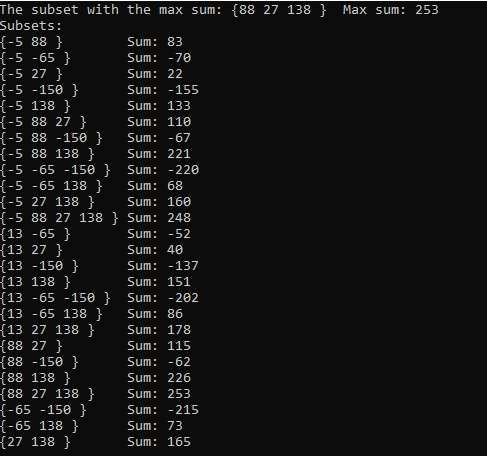

# This is an algorithm challenge with C++

## Problem
Create subsets consisting of non-adjacent elements in an integer array, and find the subset with the max sum among these subsets.

For example, if the given array is as follows arr=[-2,1,3,-4,5], subsets will be as follows:

<pre>
Subsets     Sum
[-2, 3, 5]   6

[-2, 3]      1

[-2, -4]    -6

[-2, 5]      3

[1, -4]     -3

[1, 5]       6

[3, 5]       8  <== Max Sum
</pre>

## Solution:
<pre>
Given array: int A[6]={A[0],...,A[5]};

Subsets for A[0];
                     Two-element subsets;
                        {A[0],A[2]}	------->       |   A[2]     |   A[3]    |     A[4]   |    A[5]     	---> Crossover Sequence for A[0] = {A[2],A[3],A[4],A[5]}
                        {A[0],A[3]}	------->  --------------------------------------------------------
                        {A[0],A[4]}	------->  A[0] | A[0],A[2]  | A[0],A[3] |  A[0],A[4] |  A[0],A[5]
                        {A[0],A[5]}	------->       |     |      |           |            |
                                                             |
                                                             |
                                                             V
                                                                    |    A[4]        |      A[5]          	---> Crossover Sequence for Subset {A[0],A[2]} = {A[4],A[5]}
                      Three-element subsets;                       ---------------------------------------
                        {A[0],A[2],A[4]}  --------->    A[0],A[2]   | A[0],A[2],A[4] | A[0],A[2],A[5]
                        {A[0],A[2],A[5]}  --------->
</pre>
To explain the template above, crossover sequences are created for each element of the given sequence, and two-element subsets are obtained. 
This process is repeated for the resulting two-element subsets. In this way, this process have to repeat until all subsets are obtained.

Input: { -5, 13, 88, -65, 27, -150, 138 }

Output:

